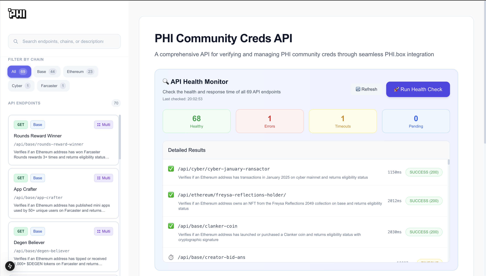

# Phi Community Cred APIs 🚀

Welcome to the Phi Community Cred APIs repository! This project provides a comprehensive suite of APIs designed to manage and verify credentials (Creds) within the **phi.box** platform. Our APIs facilitate seamless interaction with user credentials, ensure the health of the system, and offer detailed documentation for developers.



## Key Features

- **Cred Verification APIs**: Robust APIs for verifying user credentials within the **phi.box** ecosystem.
- **API Health Monitoring**: Tools to monitor and ensure the uptime and reliability of the APIs.
- **Comprehensive Documentation**: Access in-depth documentation for all available API endpoints to streamline integration and usage.

## Getting Started

To set up the **Phi Protocol API Verification** project locally, follow these steps:

1. Clone the repository:

   ```bash
   git clone https://github.com/PHI-LABS-INC/phi-community-cred-apis.git
   ```

2. Navigate into the project directory:

   ```bash
   cd phi-community-cred-apis
   ```

3. Install the necessary dependencies:

   ```bash
   npm install
   ```

4. Launch the application:
   ```bash
   npm run dev
   ```

Once running, your API will be accessible at `http://localhost:3000`.

## Contributing to Add APIs

To contribute by adding new APIs, follow these steps:

1. **Create the Endpoint**:

   - Determine the type of API you want to create (e.g., cred APIs on base).
   - Create the appropriate endpoint in the corresponding folder. For example, if you want to create a cred API on base, create the endpoint in the `base` folder.
   - Refer to this repository for understanding the structure and implementation: [Verifier Template](https://github.com/PHI-LABS-INC/verifier-template).

2. **Endpoint Requirements**:

   - Your endpoint should return a JSON object with the following three properties:
     - `mint_eligibility`: Indicates if the address is eligible for minting.
     - `data`: Contains the relevant data for the request.
     - `signature`: A cryptographic signature for the response.

3. **Add the Endpoint to Configuration**:
   - Once the API is created, add the endpoint details to the `data/api-config.ts` file.
   - Ensure you include the method, path, id, and description for the new endpoint.

## Example of an endpoint response:

Your endpoint should return a JSON object with the following three properties:

```json
{
  "mint_eligibility": false,
  "data": "0",
  "signature": "0xdf...988dfb7"
}
```
